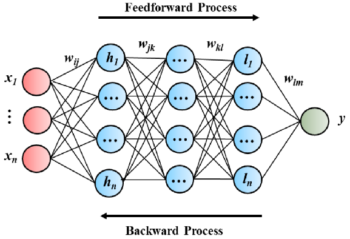

# Time Series Analysis

DA Project

- In mathematics, a time series is a series of data points indexed in time order. Most commonly, a time series is a sequence taken at successive equally spaced points in time. Thus it is a sequence of discrete-time data. Wikipedia

- Time series analysis is a specific way of analyzing a sequence of data points collected over an interval of time. In time series analysis, analysts record data points at consistent intervals over a set period of time rather than just recording the data points intermittently or randomly.

## This is a mini project with the following tasks:
* Importing necessary packages
* Extracting valuable information from the dataset
  * Checking The Shape of The Dataframe
  * Checking The Null Values
  * Checking Duplicated Values
  * Checking The Types Of Data
* Exploring And Analysing The DataFrame
#In which year and city did the Netherlands win the highest number of medals in their history?
* Visualizing
#Visualizing the number of players send by the country on each event vs the number of medals they recieve.
#visualizing first, second and third world countries and their respective performances in Olympics over these years.
* Conclusion
  

## :file_folder: dataset
For the purpose of implementing time series forecasting technique , i will utilize gold pricing from  [Data source](https://data.nasdaq.com/) ,The following snippet shows a quick one-liner to get your hands on gold pricing
information since :date: 1970s :

|    | Date                |   Value |
|---:|:--------------------|--------:|
|  0 | 1970-01-01 00:00:00 |    35.2 |
|  1 | 1970-04-01 00:00:00 |    35.1 |
|  2 | 1970-07-01 00:00:00 |    35.4 |
|  3 | 1970-10-01 00:00:00 |    36.2 |
|  4 | 1971-01-01 00:00:00 |    37.4 |

## Includes
* Data understanding
* Data preprocessing
* Analyse
  * Statistics
  * Visualisation
* Conclusion

